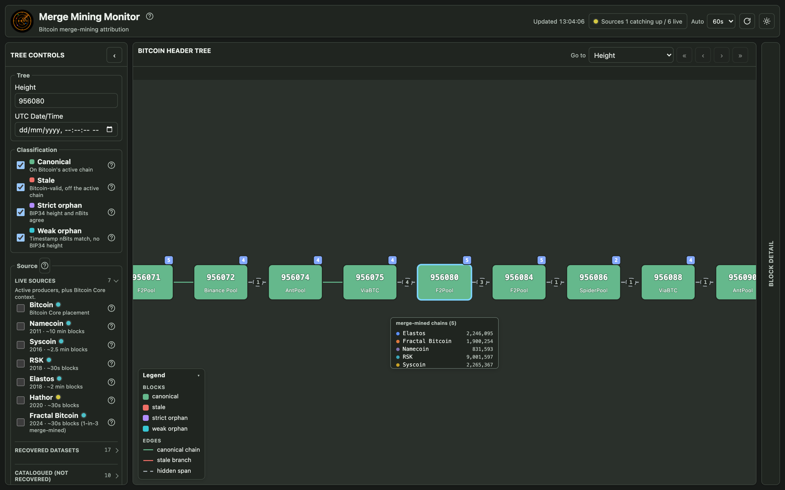
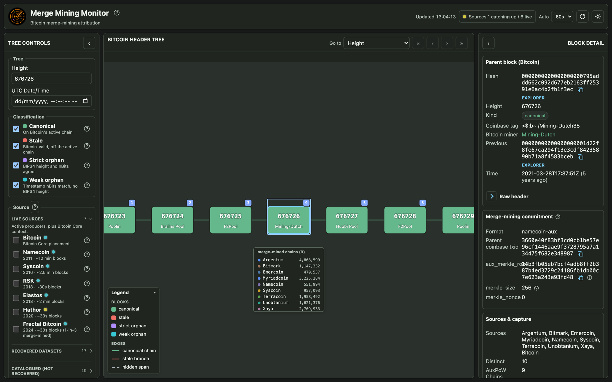
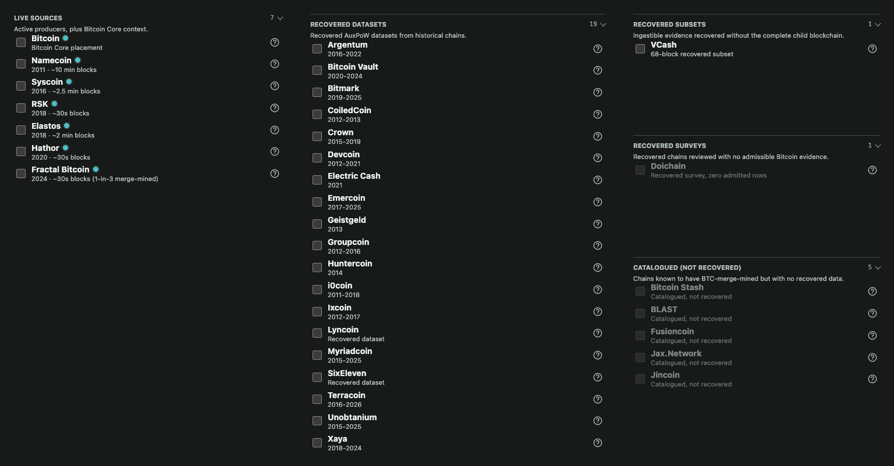
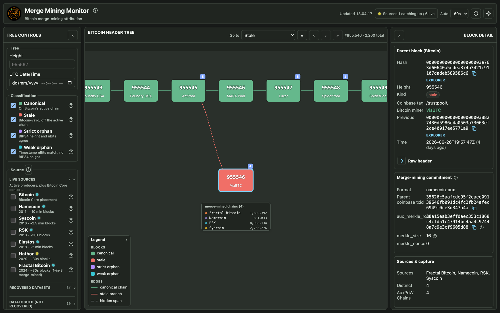
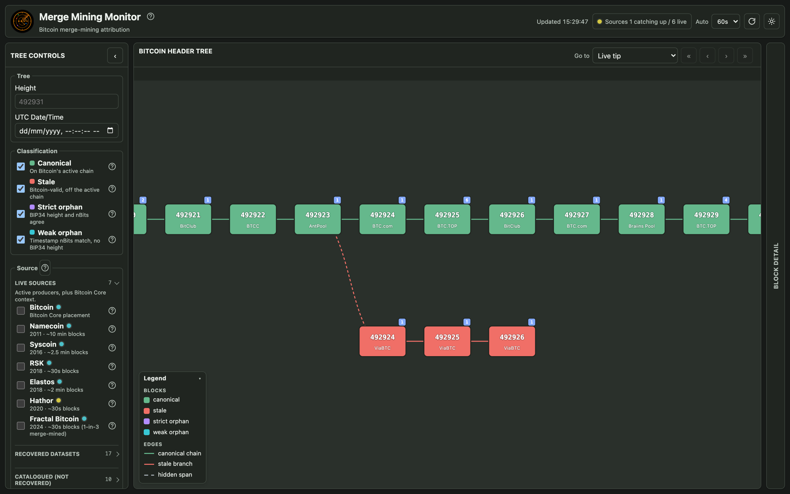
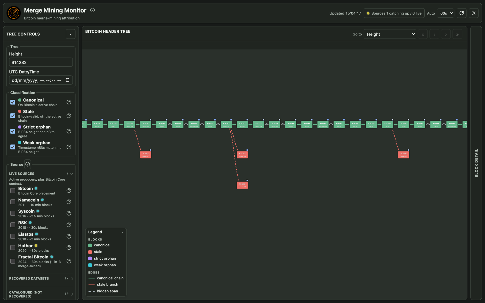
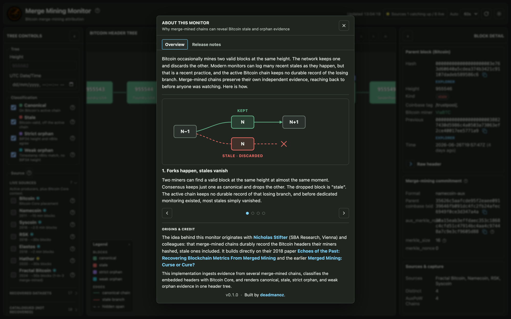

# Merge Mining Monitor

A live monitor and historical record of Bitcoin merge-mining: the pools and child
chains behind each block, and the stale and orphan blocks that evidence recovers.

Bitcoin's proof of work secures more than Bitcoin. Merge-mined chains reuse it: a
miner hashing a Bitcoin block can, at no extra work, commit that same proof to
Namecoin, RSK, Syscoin, and dozens of other chains. The Bitcoin block doesn't say
which chains rode along, though. That record lives on the child chains, where each
merge-mined block holds an [AuxPoW proof](https://deadmanoz.xyz/posts/2026/merge-mining)
pointing back at its Bitcoin block.

Merge Mining Monitor reconstructs it. Reading across the ecosystem (live producers
and long-dead chains alike), it ties each Bitcoin block to the pool that mined it
and the child chains that merge-mined it, and renders the whole header tree, from
genesis to the current tip, through that lens.

Because that evidence is durable and independent, it also preserves Bitcoin blocks
the active chain discarded: valid Bitcoin blocks that lost the race to be accepted
by the network and never made the canonical chain. Alongside that chain the monitor
recovers **2,200 stale blocks (and counting)**, spanning 2011 to today, most of them
with no durable record left on the Bitcoin network.

## Attribution for every block

*One Bitcoin block, many chains. Block 676,726 (28 March 2021), mined by Mining-Dutch, carried the
proof of work for nine merge-mined chains at once (Argentum, Bitmark, Emercoin,
Myriadcoin, Namecoin, Syscoin, Terracoin, Unobtanium, and Xaya). The Block Detail
drawer resolves the pool, the decoded AuxPoW commitment, and every child block that
rode along.*

The first screen is where the work happens. A windowed Bitcoin header tree
renders the canonical spine, each block labelled with its pool and a badge for the
number of chains that merge-mined it. From it you can:

- **Browse the whole chain** from the genesis block to the current tip, or jump
  straight to any height or UTC timestamp.
- **Inspect any block** in a detail drawer: the pool and miner, the decoded AuxPoW
  commitment, every child chain that merge-mined it (with child heights), and
  external explorer links.
- **Filter by source** to see which headers a given chain touched, and by
  classification to isolate canonical, stale, or orphan blocks.
- **Walk the record** with a single navigator across the latest stale blocks,
  stale branches, orphans, and orphan branches.

## The chains

  

The source rail groups chains by the evidence we actually hold, with Bitcoin
Core supplying canonical context:

- **Live sources** (6 producers) follow their chain tips continuously: Namecoin
  (2011), Syscoin (2016), RSK (2018), Elastos (2018), Hathor (2020), and Fractal
  Bitcoin (2024). Bitcoin Core supplies the canonical backbone and classifies
  every header.
- **Recovered datasets** (19 chains) are historical AuxPoW records from chains with
  no live producer, ingested from recovered evidence: Argentum, Bitcoin Vault,
  Bitmark, CoiledCoin, Crown, Devcoin, Electric Cash, Emercoin, Geistgeld,
  Groupcoin, Huntercoin, i0coin, Ixcoin, Lyncoin, Myriadcoin, SixEleven,
  Terracoin, Unobtanium, and Xaya. Lyncoin is complete from genesis through the
  last SHA-256d block at height 260,499 (11 canonical Bitcoin parents);
  SixEleven is complete through its available tip at height 999,406 (seven).
  The recovered dataset production artefacts will be made available in the public
  [`merge-mining-research`](https://github.com/deadmanoz/merge-mining-research)
  repository; this monitor commits the provenance manifest and derived runtime
  data it needs to import and serve them.
- **Recovered subsets** contains VCash. Archived vcash.tech pages preserve 767
  child-to-parent mappings. Bitcoin Core confirms 68 parent hashes as canonical
  and supplies their full Bitcoin headers and coinbases. Those 68 rows are
  usable evidence, but they are not the VCash blockchain (the other 699
  mappings remain unresolved).
- **Recovered surveys** contains Doichain. The complete review through height
  430,684 found 429,401 AuxPoW commitments but no canonical or stale Bitcoin
  block winner, so a successful recovery correctly produces zero rows.
- **Catalogued (not recovered)** (5 chains) are known Bitcoin-merge-mined chains
  with no ingested data yet, listed for completeness: Bitcoin Stash, BLAST,
  Fusioncoin, Jax.Network, and Jincoin.

Mazacoin is no longer in the catalogue. Its consensus source contains no AuxPoW
implementation, so treating it as a Bitcoin merge-mined recovery target was
incorrect.

Namecoin, the first merge-mined chain, is the largest single contributor, but the
picture is cross-chain: a single Bitcoin block is often merge-mined by many
independent chains at once.

If you can help fill the gaps, that is exactly the kind of contribution this
monitor is built to absorb. The full VCash chain would replace a 68-row sample;
chain data for one of the five remaining catalogue entries, or a better archive
for an existing source, would extend the record. Get in touch on X
([@ozdeadman](https://x.com/ozdeadman)) or Nostr
([deadmanoz on Primal](https://primal.net/deadmanoz)).

## Recovering stale and orphan blocks

Bitcoin keeps no durable, network-wide record of the blocks its active chain
drops. A node that received one as a competing tip may still hold it, but that
copy is local and lost to a prune or a resync. Merge-mined chains record it
regardless: the commitment in each child block carries the Bitcoin header its
miner hashed, stale ones included. Every stale block shown here is recovered from
those child-chain records, not from watching the Bitcoin network. That distinction
matters. A live fork observer such as [fork-observer](https://fork.observer) can
only capture a stale block if a node happens to see it at the tip as it happens, so
its record starts when the observer does; this monitor reconstructs stales after the
fact from the child chains, which is why the evidence reaches back to 2011, long
before any systematic, long-term effort to observe and record activity on the
Bitcoin network existed.

*One block Bitcoin forgot, up close. Bitcoin block 955,546 was mined by ViaBTC but
lost the race to MARA Pool's block at the same height. Four merge-mined chains
recorded its header, so it survives here as proven stale evidence, one of 2,200 such
blocks.*

The monitor checks every recovered header against Bitcoin Core and classifies it by
where it attaches to the canonical chain. If the block, or the block it builds on,
links to the chain, its place in Bitcoin's history is fixed: a valid header that
connects to the chain but sits off the active one, beaten by a competitor at its
height, is **stale**. A valid header whose previous-block hash matches nothing
Bitcoin Core knows cannot be anchored to the chain at all, and is a BTC **orphan**,
the harder case. Orphans then split by how well their height can still be pinned
from other evidence: a **strict orphan** carries the real Bitcoin coinbase, so BIP34
fixes its height and an nBits check confirms the difficulty epoch; a **weak orphan**
has no trustworthy coinbase height, so placement falls back to its header timestamp
and the expected nBits. Stale competition is not always a single block, so the tree
also renders multi-block stale and orphan branches.

*Stale competition is not always one block. Here a multi-block stale branch, stale
headers linked by their previous-block hashes, forks off the canonical spine and is
recovered intact.*

This recovery is not confined to deep history. It runs right up to the present, and
the busiest stretches can be the most revealing.

*Off-chain evidence at scale. Here stale and orphan markers cluster across a run of
Bitcoin heights, each one a block the active chain dropped, recovered from the chains
that merge-mined it. And not all of it is old: this run is as recent as
September 2025, a month that produced 25 stale blocks against the usual handful, most
of the attributed ones mined by Foundry USA. A spike that size, mostly from one pool,
seems to suggest Foundry ran into some infrastructure trouble.*

## Where the idea comes from

The insight that merge-mined chains durably record the Bitcoin headers their miners
hashed, stale ones included, originates with Nicholas Stifter (SBA Research,
Vienna) and colleagues. This project builds on their 2018 paper [*Echoes of the
Past: Recovering Blockchain Metrics From Merged
Mining*](https://eprint.iacr.org/2018/1134.pdf) and the earlier [*Merged Mining:
Curse or Cure?*](https://eprint.iacr.org/2017/791.pdf). The built-in About dialog
walks through the mechanism step by step.

## How it works

`merge-mining-monitor` is a Postgres-backed Rust service. Producers append raw
child-chain evidence to a single append-only log (`merge_mining_event`); a
read-model reconciler derives the deduplicated `block` tree, attributing pools and
classifying each Bitcoin parent header against Bitcoin Core. A read-only API
(`serve`) projects that read model to the static frontend. Because the base log is
append-only, the whole derived tree is rebuildable, and bad evidence can be revoked
and recomputed without losing anything proven earlier.

See [`docs/architecture.md`](docs/architecture.md) for the crate boundaries and
data flow.

## Documentation

Human-focused documentation lives in [`docs/`](docs/README.md):

- [architecture.md](docs/architecture.md) - system structure, crates, and data flow.
- [capture.md](docs/capture.md) - how each source is fetched, verified, and stored.
- [data-model.md](docs/data-model.md) - schema, read model, migrations, and classification.
- [attribution.md](docs/attribution.md) - pool attribution and child-chain identity.
- [operations.md](docs/operations.md) - setup, migrations, serving, and operator commands.
- [historical-ingest.md](docs/historical-ingest.md) - importing recovered AuxPoW datasets.
- [configuration.md](docs/configuration.md) - environment variables.
- [api-contract.md](docs/api-contract.md), [product-brief.md](docs/product-brief.md), [ui-model.md](docs/ui-model.md) - API, product, and UI contracts.
- [tree-semantics.md](docs/tree-semantics.md) - implementation notes for deriving `/api/v1/tree` and orphan navigator responses.
- [testing.md](docs/testing.md) - test surfaces and fixtures.

## Related projects

- [`fork-observer`](https://fork.observer) ([code](https://github.com/0xB10C/fork-observer)) -
  the fork-tree UI that inspired this frontend.

## License

MIT. See [LICENSE](LICENSE).
