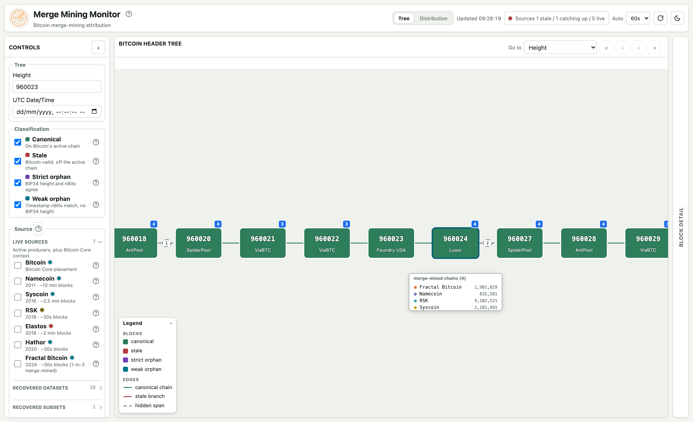
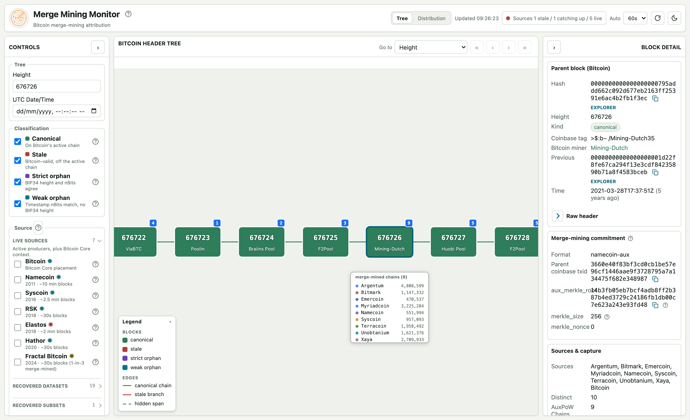
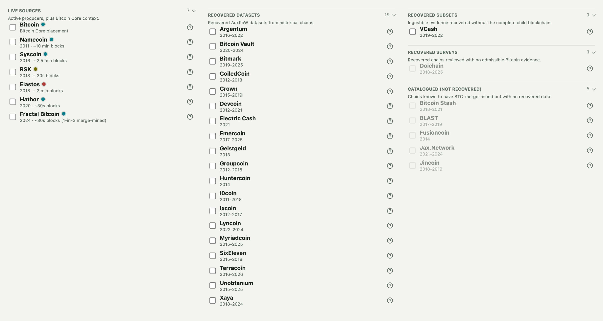
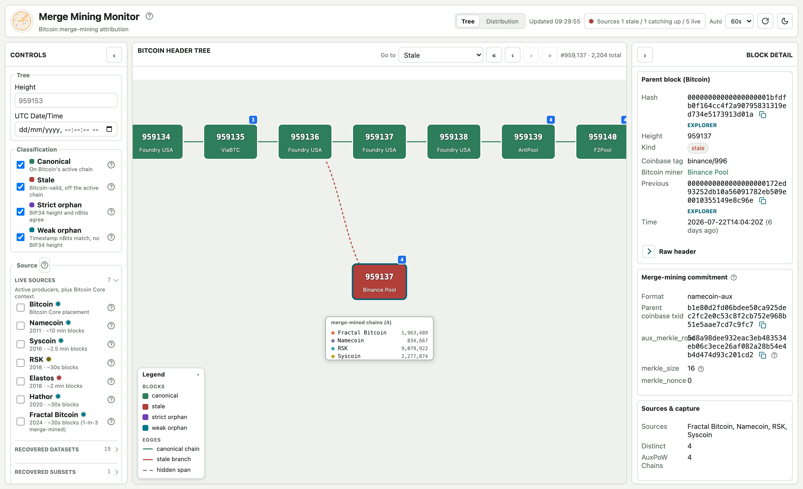
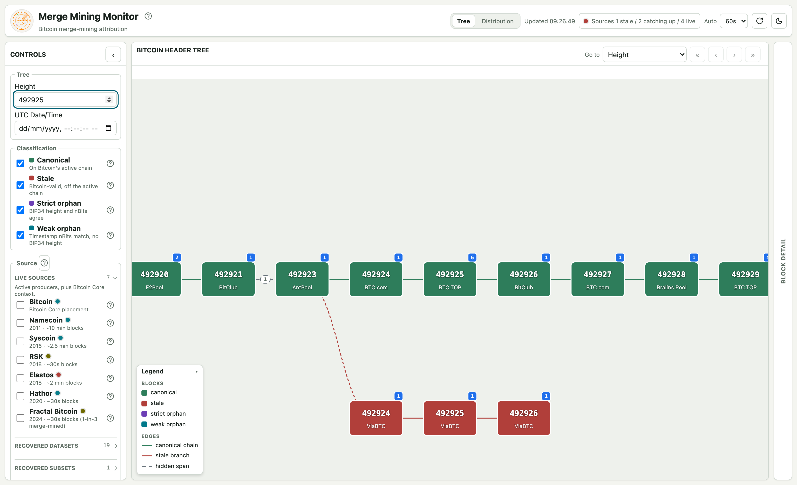
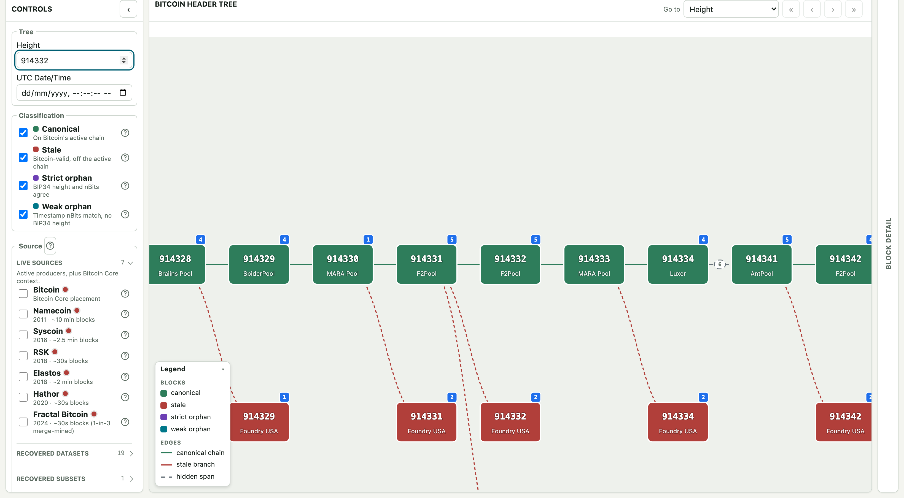
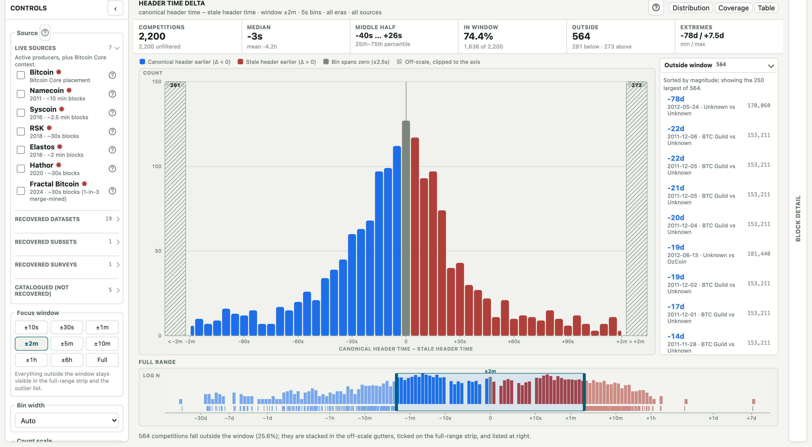
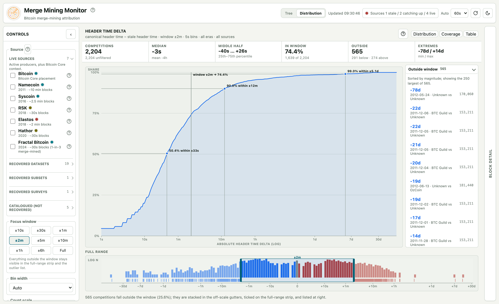
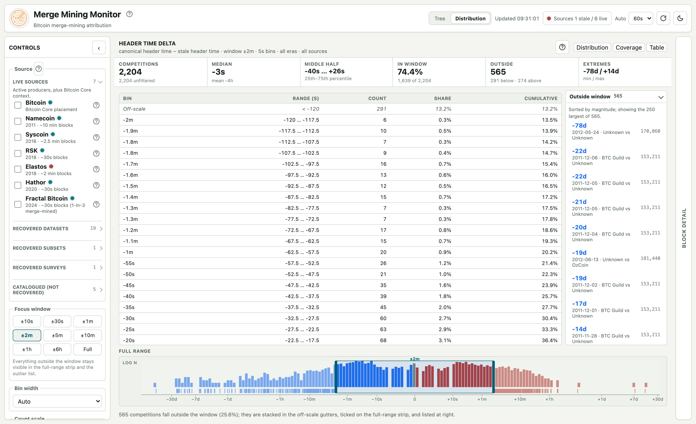
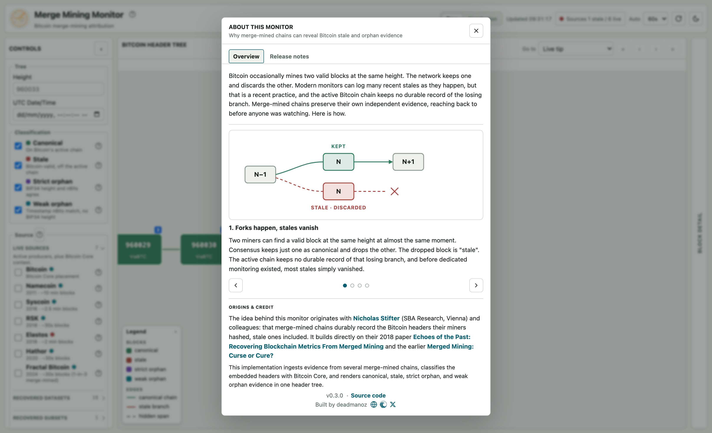

# Merge Mining Monitor

A live monitor and historical record of Bitcoin merge-mining: the pools and child
chains behind each block, and the stale and orphan blocks recovered from their
evidence.

<picture>
  <source media="(prefers-color-scheme: dark)" srcset="docs/img/hero-dark.png" />
  
</picture>

Bitcoin's proof of work secures more than Bitcoin. Merge-mined chains reuse it: a
miner hashing a Bitcoin block can, at no extra work, commit that same proof to
Namecoin, RSK, Syscoin, and dozens of other chains. The Bitcoin block doesn't say
which chains rode along, though. That record lives on the child chains, where each
merge-mined block holds an [AuxPoW proof](https://deadmanoz.xyz/posts/2026/merge-mining)
pointing back at its Bitcoin block.

Merge Mining Monitor reconstructs it. From live producers and long-dead chains
alike, it ties each Bitcoin block to the pool that mined it and the child chains
that merge-mined it, and renders the whole header tree from genesis to the
current tip. The recovery work behind the historical datasets lives in the
companion [`merge-mining-research`](https://github.com/deadmanoz/merge-mining-research)
repository.

Because that evidence is durable and independent, it also preserves Bitcoin blocks
the active chain discarded: valid Bitcoin blocks that lost the race to be accepted
by the network and never made the canonical chain. Alongside that chain the monitor
recovers **2,204 stale blocks (and counting)**, spanning 2011 to today, most of them
with no durable record left on the Bitcoin network.

## Attribution for every block

<picture>
  <source media="(prefers-color-scheme: dark)" srcset="docs/img/merge-mining-detail-dark.png" />
  
</picture>

*Block 676,726 (28 March 2021), mined by Mining-Dutch, carried the proof of work
for nine merge-mined chains at once (Argentum, Bitmark, Emercoin, Myriadcoin,
Namecoin, Syscoin, Terracoin, Unobtanium, and Xaya). The Block Detail drawer
resolves the pool, the decoded AuxPoW commitment, and each chain's child block.*

The main view is a windowed Bitcoin header tree: the canonical spine, each block
labelled with its pool and a badge for the number of chains that merge-mined it.
From it you can:

- **Browse the whole chain** from the genesis block to the current tip, or jump
  straight to any height or UTC timestamp.
- **Inspect any block** in a detail drawer: the pool and miner, the decoded AuxPoW
  commitment, every child chain that merge-mined it, authenticated child
  height/hash/header/time/`nBits` evidence where available, and external
  explorer links.
- **Filter by source** to see which headers a given chain touched, and by
  classification to isolate canonical, stale, catalogued error-block, or orphan
  evidence.
- **Step through the record** with a single navigator across the latest stale
  blocks, stale branches, orphans, and orphan branches.

## The chains

<picture>
  <source media="(prefers-color-scheme: dark)" srcset="docs/img/sources-dark.png" />
  
</picture>

The source rail groups chains by the evidence we actually hold, with Bitcoin
Core supplying canonical context:

- **Live sources** (6 producers) follow their chain tips continuously: Namecoin
  (2011), Syscoin (2016), RSK (2018), Elastos (2018), Hathor (2020), and Fractal
  Bitcoin (2024). Bitcoin Core supplies the canonical backbone and classifies
  every header.
- **Recovered datasets** (19 chains) are historical AuxPoW records from chains with
  no live producer, ingested from recovered evidence: Argentum, Bitcoin Vault,
  Bitmark, CoiledCoin, Crown, Devcoin, Electric Cash, Emercoin, Geistgeld,
  Groupcoin, Huntercoin, i0coin, Ixcoin, Lyncoin, Myriadcoin, SixEleven,
  Terracoin, Unobtanium, and Xaya. Lyncoin is complete from genesis through the
  last SHA-256d block at height 260,499 (11 canonical Bitcoin parents);
  SixEleven is complete through its available tip at height 999,406 (seven).
  The recovered dataset production artefacts live in the companion
  [`merge-mining-research`](https://github.com/deadmanoz/merge-mining-research)
  repository; this monitor commits the provenance manifest and derived runtime
  data it needs to import and serve them.
- **Recovered subsets** contains VCash. Archived vcash.tech pages preserve 767
  child-to-parent mappings. Bitcoin Core confirms 68 parent hashes as canonical
  and supplies their full Bitcoin headers and coinbases. Those 68 rows are
  usable evidence, but they are not the VCash blockchain (the other 699
  mappings remain unresolved).
- **Recovered surveys** contains Doichain. The complete review through height
  430,684 found 429,401 AuxPoW commitments but no canonical or stale Bitcoin
  block winner, so a successful recovery correctly produces zero rows.
- **Catalogued (not recovered)** (5 chains) are known Bitcoin-merge-mined chains
  with no ingested data yet, listed for completeness: Bitcoin Stash, BLAST,
  Fusioncoin, Jax.Network, and Jincoin.

Mazacoin is no longer in the catalogue. Its consensus source contains no AuxPoW
implementation, so treating it as a Bitcoin merge-mined recovery target was
incorrect.

Namecoin, the first merge-mined chain, is the largest single contributor, but the
picture is cross-chain: a single Bitcoin block is often merge-mined by many
independent chains at once.

If you can help fill the gaps, get in touch on X
([@ozdeadman](https://x.com/ozdeadman)) or Nostr
([deadmanoz on Primal](https://primal.net/deadmanoz)): the full VCash chain would
replace a 68-row sample, and chain data for any of the five remaining catalogue
entries, or a better archive for an existing source, would extend the record.

## Recovering stale and orphan blocks

Bitcoin keeps no durable, network-wide record of the blocks its active chain
drops. A node that received one as a competing tip may still hold it, but that
copy is local and lost to a prune or a resync. Merge-mined chains record it
regardless: the commitment in each child block carries the Bitcoin header its
miner hashed, stale ones included. Every stale block shown here is recovered from
those child-chain records, not from watching the Bitcoin network. A live fork
observer such as [fork-observer](https://fork.observer) can only capture a stale
block if one of its nodes sees it at the tip in real time, so its record starts
when the observer does; this monitor reconstructs stales after the fact from the
child chains, which is why the evidence reaches back to 2011, long before anyone
was systematically recording fork activity on the Bitcoin network.

<picture>
  <source media="(prefers-color-scheme: dark)" srcset="docs/img/stale-block-detail-dark.png" />
  
</picture>

*Bitcoin block 959,137 was mined by Binance Pool but lost the race to Foundry
USA's block at the same height. Four merge-mined chains recorded its header, so
it survives here as proven stale evidence, one of 2,204 such blocks.*

The monitor checks every recovered header against Bitcoin Core and classifies it by
where it attaches to the canonical chain. If the block, or the block it builds on,
links to the chain, its place in Bitcoin's history is fixed: a valid header that
connects to the chain but sits off the active one, beaten by a competitor at its
height, is **stale**. A valid header whose previous-block hash matches nothing
Bitcoin Core knows is **unknown**: Bitcoin Core cannot yet say where it belongs.
When Core positively attests that such a header is absent from its chain and the
evidence admits it, it becomes a BTC **orphan**, the harder case. Orphans split by
how well their height can still be pinned: a **strict orphan** carries the real
Bitcoin coinbase, so BIP34 fixes its height and an nBits check confirms the
difficulty epoch; a **weak orphan** has no trustworthy coinbase height, so placement
falls back to its header timestamp and the expected nBits. Unknown headers that pass
neither gate stay unknown rather than being overclaimed, and a header already
catalogued as a known stale is excluded from orphan classification outright. Stale
competition is not always a single block, so the tree also renders multi-block stale
and orphan branches.

Some headers meet Bitcoin's proof-of-work target but are mechanically known to
violate a Bitcoin consensus rule. The monitor classifies a witnessed match in its
pinned error-block catalogue separately, preserving the rejection reason without
misstating it as a stale block or orphan candidate.

<picture>
  <source media="(prefers-color-scheme: dark)" srcset="docs/img/stale-branch-dark.png" />
  
</picture>

*A multi-block stale branch forks off the canonical spine and is recovered intact,
its headers linked by their previous-block hashes.*

Nor is the record only historical: recovery runs right up to the present.

<picture>
  <source media="(prefers-color-scheme: dark)" srcset="docs/img/stale-activity-dark.png" />
  
</picture>

*On 12 September 2025 Foundry USA lost race after race: five Foundry blocks in
this fifteen-height stretch alone fell off the active chain and survive here as
recovered stale evidence, part of a two-day run of nineteen stales in a month
that produced 25 against the usual handful. A spike that size, almost entirely
from one pool, points to infrastructure trouble at Foundry.*

## Timing the races

The Header Time Delta view (the Distribution toggle in the header) plots, for
every recovered stale-versus-canonical competition, the gap between the two
blocks' header timestamps. Most races are settled within seconds: the median
sits at -3s across 2,204 competitions, and three quarters land inside a
two-minute window. The hatched gutters and the log-scale strip keep the
extremes visible, from same-second finishes to a header timestamped 78 days
adrift, and every outlier links back to its block detail.

<picture>
  <source media="(prefers-color-scheme: dark)" srcset="docs/img/header-time-delta-dark.png" />
  
</picture>

*The distribution around zero: races the canonical header timestamped first in
blue, races the stale header timestamped first in red, and the off-scale racers
stacked in the hatched gutters.*

<picture>
  <source media="(prefers-color-scheme: dark)" srcset="docs/img/header-time-delta-coverage-dark.png" />
  
</picture>

*The Coverage tab answers "what share of races landed within T seconds": half
inside ±33s, 90% within ±12m, 99% within ±5.1d.*

<picture>
  <source media="(prefers-color-scheme: dark)" srcset="docs/img/header-time-delta-table-dark.png" />
  
</picture>

*The Table tab carries the same distribution as text: per-bin counts, shares,
and cumulative coverage.*

## Where the idea comes from

<picture>
  <source media="(prefers-color-scheme: dark)" srcset="docs/img/about-dark.png" />
  
</picture>

The insight that merge-mined chains durably record the Bitcoin headers their miners
hashed, stale ones included, originates with Nicholas Stifter (SBA Research,
Vienna) and colleagues. This project builds on their 2018 paper [*Echoes of the
Past: Recovering Blockchain Metrics From Merged
Mining*](https://eprint.iacr.org/2018/1134.pdf) and the earlier [*Merged Mining:
Curse or Cure?*](https://eprint.iacr.org/2017/791.pdf). The built-in About dialog
walks through the mechanism step by step.

## How it works

`merge-mining-monitor` is a Postgres-backed Rust service. Producers write
authenticated child-chain observations to `merge_mining_event`; a read-model
reconciler derives the deduplicated `block` tree, attributing pools and
classifying each Bitcoin parent header against Bitcoin Core. Live evidence is
additive, while recovered historical and partial sources can be reconciled as
authoritative publication snapshots. A read-only API (`serve`) projects that
read model to the static frontend. Derived state is rebuildable, and bad live
evidence can be revoked and recomputed without losing proven observations.

See [`docs/architecture.md`](docs/architecture.md) for the crate boundaries and
data flow.

## Documentation

Human-focused documentation lives in [`docs/`](docs/README.md):

- [architecture.md](docs/architecture.md) - system structure, crates, and data flow.
- [capture.md](docs/capture.md) - how each source is fetched, verified, and stored.
- [data-model.md](docs/data-model.md) - schema, read model, migrations, and classification.
- [attribution.md](docs/attribution.md) - pool attribution and child-chain identity.
- [operations.md](docs/operations.md) - setup, migrations, serving, and operator commands.
- [historical-ingest.md](docs/historical-ingest.md) - importing recovered AuxPoW datasets.
- [configuration.md](docs/configuration.md) - environment variables.
- [api-contract.md](docs/api-contract.md), [product-brief.md](docs/product-brief.md), [ui-model.md](docs/ui-model.md) - API, product, and UI contracts.
- [tree-semantics.md](docs/tree-semantics.md) - implementation notes for deriving `/api/v1/tree` and orphan navigator responses.
- [testing.md](docs/testing.md) - test surfaces and fixtures.

## Related projects

- [`merge-mining-research`](https://github.com/deadmanoz/merge-mining-research) -
  the companion repository: the per-chain recovery work and the recovered AuxPoW
  datasets this monitor imports.
- [`fork-observer`](https://fork.observer) ([code](https://github.com/0xB10C/fork-observer)) -
  the fork-tree UI that inspired this frontend.

## License

MIT. See [LICENSE](LICENSE).
