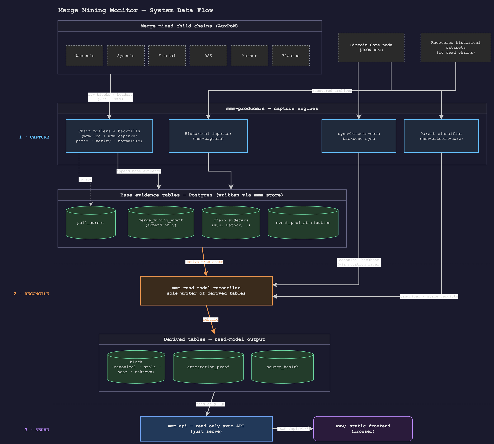

# Architecture

`merge-mining-monitor` is a Rust/Postgres service that collects evidence about
Bitcoin stale blocks from merge-mined AuxPoW child chains, live Bitcoin Core
observations, and recovered historical datasets. It turns heterogeneous source
evidence into one append-only base log, then derives a read model for the API
and frontend.

## System Flow

<p align="center">
  
</p>

The diagram shows the same ownership model as the text below: producers capture
base evidence, the read-model reconciler is the only writer of derived tables,
and the API serves those derived projections without writing capture state.

```text
1. CAPTURE          producers parse source evidence into base tables
──────────────────────────────────────────────────────────────────────
   child-chain source ──> parser / verifier ──> merge_mining_event
                                                 chain sidecar tables
                                                 event_pool_attribution

2. RECONCILE        read-model rebuilds derived tables from base evidence
──────────────────────────────────────────────────────────────────────
   base tables ─────────┐
                        ├──> read-model ──> block
   Bitcoin Core ────────┘    reconciler     attestation_proof
   (backbone + classifier)                  source_health

3. SERVE            the API projects derived tables to the frontend
──────────────────────────────────────────────────────────────────────
   derived tables ──────> axum API (`serve`) ──> static frontend in www/
```

The key design choice is that producers write base evidence only (stage 1).
Derived state (`block`, `attestation_proof`, `source_health`) is rebuilt from
that evidence by the read-model reconciler (stage 2), so a bad event can be
revoked and the affected parent block recomputed. Bitcoin Core feeds the
reconciler two ways: `sync-bitcoin-core` seeds the canonical `block` backbone
(written through the read-model mutation layer, which stays the sole writer of
derived tables), and the parent classifier supplies the stale/orphan verdicts
that annotate those rows.

## Crates

| Crate | Role |
|---|---|
| `mmm-pg` | Postgres connection configuration. No domain SQL. |
| `mmm-capture` | Offline parsing, normalization, pool resolution, source registry, and Bitcoin nBits/orphan helpers. No network or database I/O in normal builds. |
| `mmm-rpc` | Shared HTTP transport policy for child-chain clients. |
| `mmm-bitcoin-core` | The only crate that links `corepc-client`; wraps Bitcoin Core RPC and parent classification. |
| `mmm-store` | Producer-side SQL for base tables: events, sidecars, cursors, and seed helpers. |
| `mmm-read-model` | Sole writer of derived tables: `block`, `attestation_proof`, and `source_health`. |
| `mmm-producers` | Runtime engines: chain pollers/backfills, historical importer, Bitcoin Core backbone sync, and pool reclassification. |
| `mmm-api` | Read-only API views plus static frontend serving. |
| `merge-mining-monitor` | CLI wiring, generator binaries, and cross-crate integration tests. |

## Repository Layout

```text
crates/            # Rust workspace members (see the crate table above)
data/              # committed release-domain data
                   #   (pools/, consensus/, sources/, historical/)
migrations/        # squashed schema baseline (0001_) plus generated source seed (0002_)
fixtures/          # shared JSON API fixtures and per-chain parser samples
www/               # static frontend served by the read API (index.html, css/, js/, vendor/, assets/)
docs/              # this documentation set
scripts/           # migrate-safe wrapper and historical-source manifest tooling
compose.yaml       # Postgres 16 (docker compose v2)
justfile           # db, build, test, lint, serve, sync, poll, and backfill targets
```

## Boundaries

- Producers do not write derived tables.
- `mmm-api` does not import producer internals.
- Bitcoin Core access is isolated in `mmm-bitcoin-core`.
- Hash byte order follows rust-bitcoin newtypes: store `to_byte_array()` bytes
  directly and use display/RPC hex only at presentation boundaries.
- Adding a Namecoin-family source should extend the source registry and shared
  producer path, not clone a sibling chain module.

## Public Interfaces

- CLI commands are exposed by `crates/merge-mining-monitor/src/main.rs` and
  documented through `justfile`.
- Runtime API behavior is documented in `docs/api-contract.md`.
- Product and UI behavior live in `docs/product-brief.md` and
  `docs/ui-model.md`.
- Generated source metadata is owned by `crates/mmm-capture/src/source_registry`
  and emitted into `migrations/0002_seed_sources.sql` and
  `www/js/source-registry.generated.js`.
