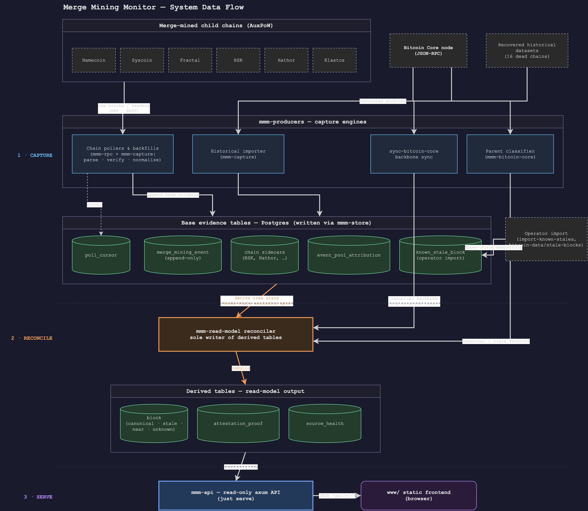

# Architecture

`merge-mining-monitor` is a Rust/Postgres service that collects evidence about
Bitcoin stale blocks from merge-mined AuxPoW child chains, live Bitcoin Core
observations, and recovered historical datasets. It turns heterogeneous source
evidence into normalized base observations, then derives a read model for the
API and frontend.

## System Flow

<p align="center">
  
</p>

The diagram shows the same ownership model as the text below: producers capture
base evidence, the read-model reconciler is the only writer of derived tables,
and the API serves those derived projections without writing capture state.

```text
1. CAPTURE          producers parse source evidence into base tables
──────────────────────────────────────────────────────────────────────
   child-chain source ──> parser / verifier ──> merge_mining_event
                                                 chain sidecar tables
                                                 event_pool_attribution
   historical publication ──> preflight / database-state comparison
                                  matching ──> no-op before Core lock
                                  mismatch ──> merge_mining_event
                                                historical_event_provenance
                                                historical_reconcile_queue

   operator import (import-known-stales) ──────> known_stale_block

2. RECONCILE        read-model rebuilds derived tables from base evidence
──────────────────────────────────────────────────────────────────────
   base tables ───────────────────────────────┐
   known_stale_block ─────────────────────────┼──> read-model ──> block
   Bitcoin Core (backbone + classifier) ──────┤    reconciler     attestation_proof
   bitcoin_core_reconcile_queue ──────────────┘    (known-stale   source_health
                                                     exclusion gate)

3. SERVE            the API projects derived tables to the frontend
──────────────────────────────────────────────────────────────────────
   derived tables ──────> axum API (`serve`) ──> static frontend in www/
```

The key design choice is that producers write base evidence only (stage 1).
Two base tables retain operator-imported provenance:
`historical_event_provenance` attaches normalized publication claims to events,
and `known_stale_block` holds known-stale membership loaded by
`import-known-stales`. The reconciler consults both as orphan-classification
exclusion evidence.
Historical import also writes `historical_reconcile_queue` in the base
transaction. After commit, the read-model bulk-rebuilds bounded batches whose
canonical classification is already proven by the Core-backed `block` row.
Stale, error, unknown, or inconsistent parents retain the strict one-parent
transaction path. Exact dependent-cascade seeds stay durable until their
cascade succeeds. This preserves chain-level snapshot atomicity without
retaining a transaction-level advisory lock for every parent in a broad
publication.
Before that write path, `import-all` streams publication provenance and compact
event state from `mmm-store`. Research publication references are deliberately
excluded from logical identity, while operator provenance is excluded from row
matching and remains visible through authoritative base-event comparison. A
complete match returns without Core access; incomplete derived state enters the
same reconciliation path without replaying publication rows.
Bounded Bitcoin Core reorg repair uses the same durability principle at a
different ownership boundary. The read-model atomically replaces the canonical
suffix and enqueues every old and new parent in
`bitcoin_core_reconcile_queue`; the producer drains those dependent-cascade
seeds only after commit and resumes them before later sync work after a restart.
When maintenance lag leaves a divergent contiguous cursor below the normal
live-tip view, the producer captures a second bounded view ending at that cursor
and replaces only its divergent suffix. Ordinary follow batches retain ownership
of the remaining catch-up distance to the live tip.
The canonical spine therefore changes atomically. Dependent rows converge from
a durable two-phase worklist, with the pending state exposed until every parent
has been reconciled and its newly discovered dependents have been enqueued.
Displaced Core and AuxPoW evidence remains queryable as stale.
Core-backed classifiers and reconcilers take the shared header-cache lock before
the shared canonical-view barrier. Suffix replacement takes the shared cache
lock before holding the canonical barrier exclusively through commit; ordinary
canonical-row writers and sync-state bookkeeping take only the exclusive
canonical barrier. This ordering lets cache refresh drain a committed suffix
queue before reclassification without a cache/canonical lock cycle. The suffix
validates its pinned Core target after acquiring the barriers and again after
staging the mutation.
Derived state (`block`, `attestation_proof`, `source_health`) is rebuilt from
that evidence by the read-model reconciler (stage 2), so a bad event can be
revoked and the affected parent block recomputed. Bitcoin Core feeds the
reconciler two ways: `sync-bitcoin-core` seeds the canonical `block` backbone
(written through the read-model mutation layer, which stays the sole writer of
derived tables), and the parent classifier supplies the stale/orphan verdicts
that annotate those rows.

## Crates

| Crate | Role |
|---|---|
| `mmm-pg` | Postgres connection configuration. No domain SQL. |
| `mmm-capture` | Offline parsing, normalization, pool resolution, source registry, and Bitcoin nBits/orphan helpers. No network or database I/O in normal builds. |
| `mmm-rpc` | Shared HTTP transport policy for child-chain clients. |
| `mmm-bitcoin-core` | The only crate that links `corepc-client`; wraps Bitcoin Core RPC and parent classification. |
| `mmm-store` | SQL for producer base tables: events, sidecars, cursors, and seed helpers. It also exposes the read-only Core-header-cache loader shared by reconciliation and the API. |
| `mmm-read-model` | Sole writer of derived tables: `block`, `attestation_proof`, and `source_health`. |
| `mmm-producers` | Runtime engines: chain pollers/backfills, historical importer, Bitcoin Core backbone sync, and pool reclassification. |
| `mmm-api` | Read-only API views plus static frontend serving. |
| `merge-mining-monitor` | CLI wiring, generator binaries, and cross-crate integration tests. |

## Repository Layout

```text
crates/            # Rust workspace members (see the crate table above)
data/              # committed release-domain data
                   #   (pools/, consensus/, sources/, findings/, historical/)
migrations/        # squashed schema baseline (0001_) plus generated source seed (0002_)
fixtures/          # shared JSON API fixtures and per-chain parser samples
www/               # static frontend served by the read API (index.html, css/, js/, vendor/, assets/)
docs/              # this documentation set
scripts/           # migrate-safe wrapper and historical-source manifest tooling
compose.yaml       # Postgres 16 (docker compose v2)
justfile           # db, build, test, lint, serve, sync, poll, and backfill targets
```

## Boundaries

- Producers do not write derived tables.
- `mmm-api` does not import producer internals.
- `mmm-api` may read the persisted Core-header cache through `mmm-store`; it never calls Core RPC.
- Bitcoin Core access is isolated in `mmm-bitcoin-core`.
- Hash byte order follows rust-bitcoin newtypes: store `to_byte_array()` bytes
  directly and use display/RPC hex only at presentation boundaries.
- Adding a Namecoin-family source should extend the source registry and shared
  producer path, not clone a sibling chain module.

## Public Interfaces

- CLI commands are exposed by `crates/merge-mining-monitor/src/main.rs` and
  documented through `justfile`.
- Runtime API behavior is documented in `docs/api-contract.md`.
- Product and UI behavior live in `docs/product-brief.md` and
  `docs/ui-model.md`.
- Generated source metadata is owned by `crates/mmm-capture/src/source_registry`
  and emitted into `migrations/0002_seed_sources.sql` and
  `www/js/source-registry.generated.js`.
- The generated findings corpus is owned by
  `crates/mmm-capture/src/findings_registry/mod.rs`, which validates the
  hand-authored `data/findings/` files and emits
  `www/js/findings.generated.js`.
