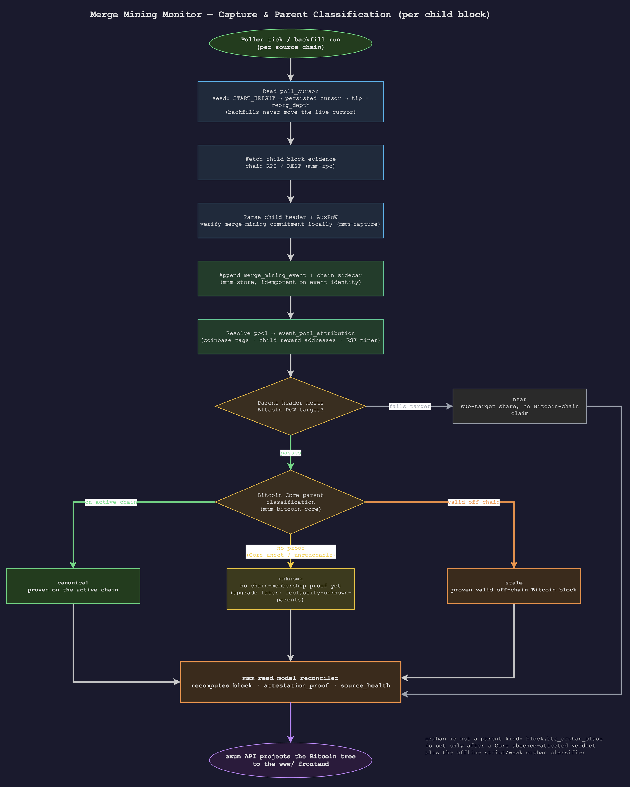

# Capture Sources

Every source follows the same high-level contract: fetch child-chain evidence,
verify enough of it locally to make it safe to store, normalize it into
`merge_mining_event`, and let the read model derive Bitcoin tree state.

## Capture And Classification Flow

  

For a live child block, the poller advances from cursor selection to source
fetching, AuxPoW parsing, event insertion, sidecar insertion, and pool
attribution. Parent classification then splits on two checks: Bitcoin target
validation first, then Bitcoin Core placement. Target failures become `near`;
Core-known parents become `canonical` or `stale`; Core-absent but target-valid
parents remain `unknown` until a later `reclassify-unknown-parents` pass can
upgrade them. BTC orphan status is a later refinement of Core-absent `unknown`
parents, not a separate parent kind.

## Live Sources

| Source | Capture path | Notes |
|---|---|---|
| Namecoin | Core-style raw block RPC: `getblock <hash> 0`. | Namecoin-family AuxPoW parser. |
| Syscoin | Core-style raw block RPC: `getblock <hash> 0`. | Same shared parser as Namecoin, with Syscoin activation/version gates. |
| Fractal Bitcoin | `getblockheader <hash> false true` for `[header][CAuxPoW]`, plus child block data when needed. | Fractal raw blocks do not carry inline CAuxPoW. |
| RSK | Ethereum-style RSKj JSON-RPC for canonical blocks and uncles. | Stores RSK proof sidecar data and miner beneficiary identity. |
| Hathor | Public REST API plus Hathor RFC 0006 merged-mining reconstruction. | No self-hosted mainnet node assumption; reward outputs are parsed from persisted funds graph data. |
| Elastos | JSON-RPC `getblockbyheight`. | Reconstructs the 84-byte child header and verifies the AuxPoW commitment. |
| Bitcoin Core | `sync-bitcoin-core`. | Writes canonical backbone headers and coinbase evidence for tree browsing. |

## Polling And Backfill

Live pollers use `poll_cursor`, not `MAX(child_height)`, as progress state.
Cursor seeding order is:

1. explicit `<PREFIX>_START_HEIGHT`
2. persisted cursor
3. `tip - reorg_depth`

Backfills are bounded, idempotent over event identity, and do not move the live
cursor. Use the `just poll-CHAIN` and `just backfill-CHAIN START END` recipes
for `namecoin`, `rsk`, `syscoin`, `fractal`, `hathor`, and `elastos`.

## Shared Producer Rules

- Namecoin-family chains should extend the shared chain spec and AuxPoW family
  path.
- Divergent chains may have their own module, but still write through shared
  store and read-model entry points.
- Producers write base evidence and sidecars only. They do not maintain
  `block`, `attestation_proof`, or `source_health` directly.
- Long child-chain backfills may run with `BITCOIN_RPC_URL` unset, then upgrade
  the deferred `unknown` parents afterward with
  `just reclassify-unknown-parents`. Dataset imports are stricter: see
  `docs/historical-ingest.md`.
