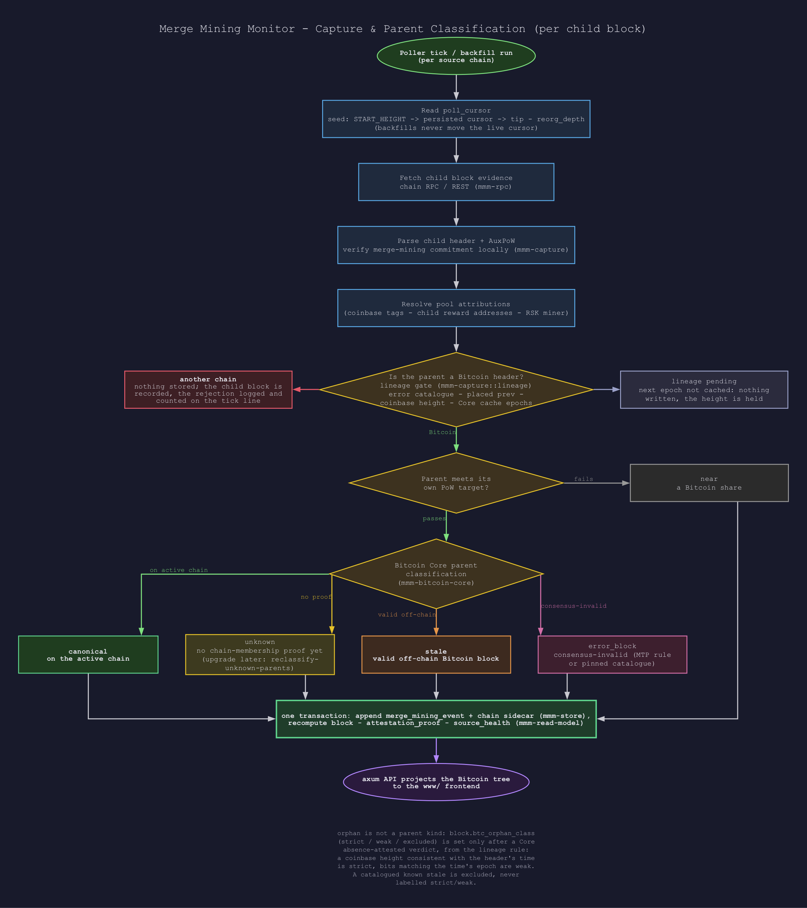

# Capture Sources

Every source follows the same high-level contract: fetch child-chain evidence,
verify enough of it locally to make it safe to store, normalize it into
`merge_mining_event`, and let the read model derive Bitcoin tree state.
Child height, hash, header, time, and `nBits` are independent optional evidence;
unavailable values remain `NULL`.

## Capture And Classification Flow

  

For a live child block, the poller advances from cursor selection to source
fetching, AuxPoW parsing and pool attribution. The capture then passes the
[Bitcoin lineage gate](#bitcoin-lineage-gate): a parent that is not a Bitcoin
header is never stored. Parent classification starts with the parent's own
target and Bitcoin Core placement. Target failures become `near`; Core-known
parents become `canonical` or `stale`. For a Core-absent target-valid parent with a known
predecessor, the classifier verifies its expected `nBits` and reads the exact
eleven linked predecessor headers to apply Bitcoin's median-time-past rule. A
timestamp at or below that median becomes `error_block` with the
`time_below_mtp` reason. The pinned consensus-invalid catalogue remains the
fallback for rules not yet derived live, and cross-checks a live MTP verdict
when both are available. Its legacy `median_time_past_violation` evidence token
is semantically equivalent to `time_below_mtp`; matching live classifications
retain the catalogue token. An incomplete MTP window stays `unknown`, never an
orphan. Other Core-absent target-valid parents remain `unknown` until a later
`reclassify-unknown-parents` pass can upgrade them. BTC orphan status is a later
refinement of Core-absent `unknown`
parents, not a separate parent kind, and it is gated by the operator-imported
`known_stale_block` membership: a header catalogued as a known stale is
`excluded` from strict/weak orphan classification rather than overclaimed.

## Bitcoin Lineage Gate

Merge mining lets a child chain commit to any SHA-256 parent, and a proof that
verifies says nothing about whether the parent is a Bitcoin header. Bitcoin
Cash blocks and shares, and other SHA-256 chains' blocks, verify just as well;
most of Terracoin's parents are Bitcoin Cash headers. Every live capture
therefore passes one gate in the shared seam, `mmm_read_model::capture_in_txn`,
before classification or any Bitcoin Core call. It decides from local evidence
under the shared Core-cache lock the capture already holds, using the rule in
`mmm_capture::lineage`:

1. A header in the pinned error catalogue is Bitcoin's (block 717,696 kept the
   previous epoch's bits by design).
2. A prev the Monitor has placed (a canonical, stale or error block, or the
   Core cache's tip): a share is Bitcoin's whatever its bits, since pool
   templates briefly keep the previous epoch's bits across a retarget; a
   block must carry the epoch bits for the prev's height plus one.
3. A strict BIP34 coinbase height consistent with the header's time must
   carry that height's epoch bits. A height outside the epoch the time
   selects falls to the next step, since another chain's heights run ahead
   of Bitcoin's.
4. Otherwise the bits must match the epoch the header's time selects or a
   neighbour. A header newer than the cache must carry the latest epoch's
   bits (or, for a share, the previous epoch's).

A verdict that needs an epoch the cache has not reached (a block right after a
retarget) is pending, and a coinbase height more than 144 blocks past the
cache's tip is another chain's. A BIP34 mismatch alone never rejects.

The capture returns `Written`, `NotBitcoin` or `LineagePending`. A foreign
parent writes nothing, and any event the source already held for that child
block is deleted in the same transaction, since a Core-cache change can turn a
stored verdict. The producer still records the block as the chain's block at
its height with a settled outcome, so a rescan does not capture it again. A
pending parent writes nothing and holds the height: the live cursor stops
there until a later tick's cache refresh decides it, and a bounded backfill
stops with an error. Rejections are logged per block and counted on the
`poll tick` line (`non_bitcoin`) and in backfill summaries
(`non_bitcoin_parent`); nothing about them is stored.

The same rule decides the strict/weak orphan class of Core-absent `unknown`
parents, which the historical importer relies on: it stores unknown rows only
with a strict or weak verdict, and a pinned publication aborts on any row it
would skip.

## Live Sources

| Source | Capture path | Notes |
|---|---|---|
| Terracoin | Raw block RPC: `getblock <hash> false`. | Shared classic parser; mainnet genesis, chain ID 50 on the child and not on the parent (strict chain IDs), child height/hash, commitment and child target checks. Activation 833,000. |
| Namecoin | Core-style raw block RPC: `getblock <hash> 0`. | Namecoin-family AuxPoW parser. |
| Syscoin | Core-style raw block RPC: `getblock <hash> 0`. | Same shared parser as Namecoin, with Syscoin activation/version gates. |
| Fractal Bitcoin | `getblockheader <hash> false true` for `[header][CAuxPoW]`, plus child block data when needed. | Fractal raw blocks do not carry inline CAuxPoW. |
| RSK | Ethereum-style RSKj JSON-RPC for canonical blocks and uncles. | Stores RSK proof sidecar data and miner beneficiary identity. |
| Hathor | Public REST API plus Hathor RFC 0006 merged-mining reconstruction. | No self-hosted mainnet node assumption; reward outputs are parsed from persisted funds graph data. |
| Elastos | JSON-RPC `getblockbyheight`. | Reconstructs the 84-byte child header and verifies the AuxPoW commitment. |
| Qbit | Core-style raw block RPC: `getblock <hash> 0`, of which only the exact extended-header prefix is decoded. | Qbit's extended header is not a classic CAuxPoW and has no `hashBlock` field, so it uses the dedicated Qbit decoder and is projected straight into normalized evidence. |
| Bitcoin Core | `sync-bitcoin-core`. | Writes canonical backbone headers and coinbase evidence for tree browsing; follow mode atomically repairs bounded near-tip or lagged-cursor reorg suffixes and retains the displaced side as stale evidence. |

The bitcoind-family runner (Namecoin, Syscoin, Fractal, Qbit, Terracoin), the Elastos
producer and the Hathor producer record which block the child chain carries at
every height they process. A captured
AuxPoW block is recorded inside its capture transaction, after the event
upsert and under the per-height lock the capture transaction takes first; a
block that yields no event (non-AuxPoW, or a malformed proof) is recorded in
a transaction of its own. The whole height, from the block observation
(`getblockhash`, or the REST fetch) to the last write, runs under a
session-level lock on the height,
so an overlapping poller and backfill observe and write one after the other
and the later observation describes the chain. A rescanned height whose block
changed therefore marks the earlier event displaced rather than leaving two
current blocks, and a flip back restores it. Poll and backfill share the
per-height path, so a
backfill over a reorged range repairs it the same way. See `docs/data-model.md`,
"Child Displacement". Elastos records only a proven block, one whose AuxPoW
commitment verified and whose parent meets the child target, because its
endpoint may be untrusted and a self-consistent but fabricated response must not
displace real events; a non-merge-mined or malformed block at a rescanned
height leaves the earlier record in place. Hathor records a block once its
RFC 0006 reconstruction identity holds and its hash meets the target of the
weight it declares; that weight is the endpoint's claim, so a block may
displace a captured block at its height only when it declares at least that
block's weight less what Hathor's difficulty adjustment could have moved
across the fork between them: one step (0.25) each way when the two share a
parent, the common one-deep reorg, and otherwise 0.25 per block on each
branch across the configured rescan depth, itself bounded at 32 blocks. A
height with no captured block to hold it against records nothing. A response for another height than
the one requested holds the height for a retry rather than counting it as
processed; the position itself stays the endpoint's assertion, as it is for
every captured event. A merge-mined block whose parent misses its
own target, the common case, is recorded without an event, as is one whose
parent the lineage gate refuses; a voided
block names no replacement and records nothing; a non-merge-mined block
carries no proof the producer verifies and is not recorded; the archive cache
ingest (`backfill-hathor-cache`) replays a snapshot of the chain as it was and
records nothing. A replaced or voided Hathor block is never revoked.

RSK replays may refine role and optional proof fields, but an existing sidecar's
block identity, height, miner, merge-mining hash, proof format, and any two
non-null optional proof values must remain compatible. A contradictory replay
fails the whole event transaction, including historical provenance.

Hathor live capture can promote a matching height-only historical observation
to exact child-hash identity in place. The displacement record treats such a
hashless row as the live block when its Bitcoin parent matches it.

## Polling And Backfill

Hathor capture requires the reconstructed parent transaction to be a coinbase
before accepting its input script, and retains the full transaction for later
validation. Strict BIP34 classification checks that transaction and its script
match. For unknown parents, older Hathor observations without the full
transaction retain weaker evidence semantics until normal replay or historical
import supplies it; reclassification alone does not authenticate a retained
script.

Live pollers use `poll_cursor`, not `MAX(child_height)`, as progress state.
Cursor seeding order is:

1. explicit `<PREFIX>_START_HEIGHT`
2. persisted cursor
3. `tip - reorg_depth`

Each tick re-observes the `reorg_depth` heights ending at and including the
persisted cursor, then advances the cursor by up to the batch size. A
re-observed height costs one block-hash lookup at the node when the chain
still carries the block recorded in `child_chain_head` with a final outcome
(the bitcoind family and Hathor, whose block metadata names the block);
only a changed hash, a missing record, a record whose verdict may still
change (a proof that did not parse, a verdict that follows the Core cache,
a parent classification a tolerated Core lookup failure cut short, or a
parent Core attested absent, since the poller can reach Core before Core
has the Bitcoin block the child names), an
open `capture_error` at the height (only a successful reprocessing may clear
it, whatever the record says), or, for Hathor, a sidecar added or rewritten at the height
since the record (its work-floor check must be held against the evidence
now) captures the height again. Elastos fetches its whole block in one
call either way, and RSK re-captures its window in full. Only
once the cursor has caught up with the tip does that window end at and
include the tip instead, and a poller catching up after an outage rescans
behind its cursor and does not see near-tip replacements until it gets
there. The depth is a deployment setting (`<PREFIX>_REORG_DEPTH`), zero by
default for every chain except RSK and Hathor; with every live producer
except RSK recording child displacement, a chain's depth can be raised
without leaving two current blocks or revoking a replaced one.

For Hathor, the displacement work floor is bounded at a 32-block fork
(`HATHOR_MAX_DISPLACEMENT_FORK_DEPTH`), so a depth above 32 still rescans
that far, but a replacement across a deeper fork may be captured without
being recorded as the chain's block.

Backfills are bounded, idempotent over event identity, and do not move the live
cursor. Use the `just poll-CHAIN` and `just backfill-CHAIN START END` recipes
for `namecoin`, `rsk`, `syscoin`, `fractal`, `hathor`, `elastos`, `qbit`, and `terracoin`.

### Malformed Proofs

A height whose block claims a merge-mining proof that fails to decode is never
written and never demotes prior evidence. What happens next is per-chain spec
data, not a property of the failure:

- Namecoin, Syscoin, and Fractal log the failure and continue. The interval is
  still reported complete.
- Qbit and Terracoin hold the interval. The producer persists a `capture_error` row for the
  height BEFORE returning, so a crash between detection and return cannot lose
  the signal. A new live height then holds the cursor; a replayed height
  continues, because replay is best-effort by the poller's contract, and the
  persisted row is what keeps that gap visible once the monotonic cursor is past
  it; a bounded backfill over a range containing one exits non-zero rather than
  logging completion.

The row clears only when that SAME height is reprocessed successfully. An
unrelated cursor advance never clears it, and the poll cursor is never lowered.
`/api/v1/sources` reports the source's earliest unresolved height as
`sync.error_code = auxpow_capture_error`, ahead of the ordinary live/stale
verdict.

A held live height is retried every tick, so a permanently undecodable block
stops the cursor until an operator resolves it. That is deliberate: the
alternative is a complete-looking interval with a silent hole. The source reads
`error` throughout, and `capture_error.detail` carries the decode failure.

RSK's live acquisition floor of 139,999 records the historical capture boundary,
not the first usable merge-mining proof or the RSKIP-92 format transition.
Explicit bounded backfills can start below it. Capture accepts complete
80-byte Bitcoin parent headers and skips fallback-signature payloads, evaluating
each listed uncle independently. A Bitcoin parent header that fails its own
proof-of-work target is stored as `near`; a parent from another chain is not
stored, and `canonical_non_bitcoin` and `uncles_non_bitcoin` count them. Backfill summary fields
`canonical_no_parent_header` and `uncles_no_parent_header` count skips lacking
a complete parent header.

## Shared Producer Rules

- Namecoin-family chains should extend the shared chain spec and AuxPoW family
  path.
- Divergent chains may have their own module, but still write through shared
  store and read-model entry points.
- Producers write base evidence and sidecars only. They do not maintain
  `block`, `attestation_proof`, or `source_health` directly.
- A captured `child_block_time` is the child block's own stamp, whichever field
  the chain commits (header `nTime` for the Namecoin family, the RSK block
  timestamp, the Hathor transaction timestamp). It is the source's claimed
  timestamp, read from a header, an RPC response, or a publication column, with
  no build ever observed and, outside the verified paths, nothing tying it to
  the merge-mining commitment. It is not when the child block was broadcast, and
  it does not identify which Bitcoin job carried the template, since one
  unchanged template can be committed into many successive jobs. Whoever set it
  need not be the Bitcoin pool either. See
  "What `child_block_time` Means" in
  `docs/data-model.md` before reading it as a clock on the Bitcoin block.
- Live capture is additive. Historical and partial publication sources reconcile
  as authoritative snapshots through the shared source lifecycle, while live
  publication imports never remove live events.
- Historical error-block witnesses use a separate publication scope.
  The importer accepts them only when Bitcoin Core and the pinned catalogue
  agree on the consensus-invalid parent, then writes the same event and RSK
  sidecar shapes used by live capture. Normal snapshot replacement never
  removes that witness scope.
- Capture, backfills, historical imports, and reconciliation require
  `BITCOIN_RPC_URL`. Each command refreshes the Core-header cache through the
  current synced tip before it starts. Long-lived pollers and
  `sync-bitcoin-core --follow` refresh the cache on every tick, verifying that
  Core's horizon did not move while the sparse snapshot was read, and that an
  advancing tip still descends from the prior shallow horizon. A changed shallow
  suffix schedules a recheck of existing and pending orphan rows; expanded
  coverage schedules a recheck of pending rows unless a new retarget boundary
  falls within existing timestamp coverage, in which case existing orphans are
  in scope too. The cache records that work durably as a pending generation
  and the scheduled job `reclassify-unknown-parents --scheduled` consumes it
  one page per lock hold (`docs/operations.md`); no refresh does it. Only the
  changes that can alter verdicts already given (a changed shallow suffix, a
  boundary inside coverage, an empty cache) restart a pass the job has in
  flight; an ordinary horizon advance accumulates for a follow-up pass. Before a
  refresh reads or replaces the cache it drains the committed Core suffix
  cascade one batch per lock hold, releasing the lock between batches, and
  replaces the cache only in the hold that found the queue empty. Its
  timestamp coverage does
  not regress when a valid newer Core header has an older timestamp. Historical
  imports retain that lock across candidate validation and
  the durable derived rebuild, so one import uses one table. The read-only API
  serves the persisted cache without making Core RPC calls. A parent whose
  lineage waits on the next epoch is held and retried after the next tick's
  refresh (see [Bitcoin Lineage Gate](#bitcoin-lineage-gate)).

Terracoin also retains per-height RPC and operational failures as
`height_capture_failed`. These share the public capture-error state and clear
only after successful processing of the same height.

The family spec declares raw-RPC verbosity separately from classic proof authentication.
One `CaptureFailurePolicy` owns malformed handling, operational-failure retention
and successful same-height clearing. Strict classic parsing lives in
`mmm-capture::auxpow::parse_verified_classic_block`; producers supply expected
identity and own endpoint checks and persistence, without decoding wire layouts.
Legacy parsing and Qbit/Elastos proof semantics remain unchanged.
